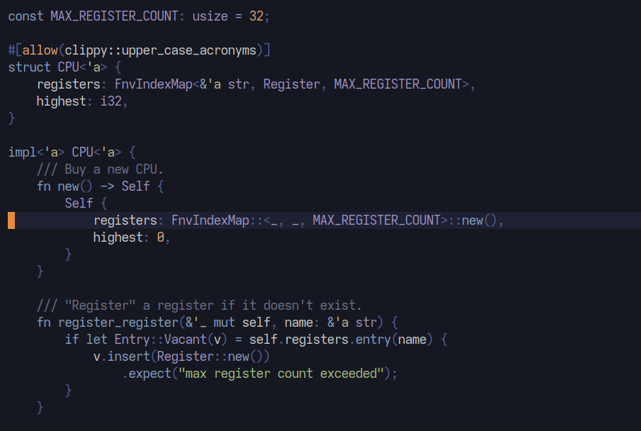

Icecube
=======

A cool, icy colorscheme based heavily on Iceberg and built using zenburn.nvim as a template.



Installation
------------

Using your favorite package manager:

[vim-plug](https://github.com/junegunn/vim-plug)

```vim
Plug "mwcz/icecube.nvim"
```

[packer](https://github.com/wbthomason/packer.nvim)

```lua
use {
    "mwcz/icecube.nvim",
    config = function() require("icecube").setup() end
}
```

[paq](https://github.com/savq/paq-nvim)

```lua
require("paq") {
    "mwcz/icecube.nvim";
}
```

Setup
-----

With VimScript:

```vim
colorscheme icecube
```

With lua:

```lua
require("icecube").setup()
```

To set the theme in lualine:

```lua
require("lualine").setup {
    options = {
        theme = "icecube",
    }
}
```

Status
------

Icecube is in *Alpha* status, being based on Zenburm.nvim which is itself in
alpha. I created this by copying the colors from Iceberg's `iceberg.vim` file
into the Zenburn.nvim repo.  Probably a bad move, but I felt more comfortable
with the lua-based layout of Zenburn.nvim, and wanted to use it to make tweaks
to Iceberg.

Contributing
------------

Pull requests are always welcome, especially for additional plugins and for
cleaning up the excessive highlight groups that I copied in from `iceberg.vim`.
Please include one or more screenshots showcasing your contribution.
